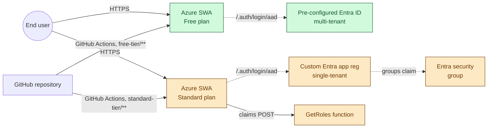

# Static website with Microsoft sign-in (reference example)

A working example of a website where some pages are open to everyone and other pages require visitors to sign in with their Microsoft account before they can read them. Built on **Azure Static Web Apps** (Microsoft's service for hosting websites) with sign-in handled by **Microsoft Entra ID** (formerly called Azure Active Directory).

The example site is a fictional "Contoso" company annual review:

- The **Overview** page is public &mdash; anyone can read it.
- The **Annual Report** and **Strategy** pages are protected &mdash; only people you've given access to can read them.

This is the pattern you'd use for board reports, investor updates, partner-only documents, or any site where you want a public marketing page plus a private members-only area, without running a traditional server.

---

## What's in this repo

There are two complete versions of the same site, in two folders. Both versions look identical when visited; the only difference is **how visitors get permission to read the protected pages**.

| Folder | Sign-in setup | Who can read the protected pages | Cost |
|---|---|---|---|
| **[`free-tier/`](free-tier/)** | Uses Microsoft's built-in sign-in. No setup beyond clicking through the Azure portal. | Up to 25 people you invite one at a time, via emailed invitation links. | Free. |
| **[`standard-tier/`](standard-tier/)** | You register your own sign-in app in Microsoft Entra ID and connect it to a security group. | Everyone in the group automatically. No invitations needed. Add a person to the group &rarr; they can read. Remove them &rarr; they can't. | Standard-tier pricing (see [the pricing page](https://azure.microsoft.com/en-us/pricing/details/app-service/static/) for the current number). |

> **Which one should you pick?** If you have a small, fixed audience (a board of 10, a handful of investors), use **Free**. If your audience changes often or is more than 25 people, or you already manage access via Entra groups, use **Standard**.

You can host both at the same time from this one repo &mdash; each becomes a separate website with its own URL.

---

## Contents

- [Architecture overview](#architecture-overview)
- [**Free-tier walkthrough**](#free-tier-walkthrough) &mdash; recommended starting point
  - [Before you start](#before-you-start-free)
  - [Step 1: Create the website in Azure](#step-1-create-the-website-in-azure-free)
  - [Step 2: Try it out](#step-2-try-it-out-free)
  - [Step 3: Invite people to the protected pages](#step-3-invite-people-to-the-protected-pages)
- [**Standard-tier walkthrough**](#standard-tier-walkthrough) &mdash; for group-based access
  - [Before you start](#before-you-start-standard)
  - [Step 1: Register a sign-in app in Microsoft Entra ID](#step-1-register-a-sign-in-app-in-microsoft-entra-id)
  - [Step 2: Find your security group's ID](#step-2-find-your-security-groups-id)
  - [Step 3: Create the website in Azure](#step-3-create-the-website-in-azure-standard)
  - [Step 4: Add the three secret values to the website](#step-4-add-the-three-secret-values-to-the-website)
  - [Step 5: Update one value in the config file](#step-5-update-one-value-in-the-config-file)
  - [Step 6: Try it out](#step-6-try-it-out-standard)
- [Security model: what's exposed and what's protected](#security-model-whats-exposed-and-whats-protected)
- [**Hardening: certificate in Key Vault instead of a client secret**](#hardening-certificate-in-key-vault-instead-of-a-client-secret)
  - [The trade-off](#the-trade-off)
  - [What it doesn't fix](#what-it-doesnt-fix)
  - [Steps](#steps)
- [**Further hardening (optional)**](#further-hardening-optional)
  - [Azure Front Door with WAF](#azure-front-door-with-waf)
  - [IP restrictions](#ip-restrictions-standard-plan-only)
  - [Private endpoint](#private-endpoint-standard-plan-only)
  - [Monitoring and alerting](#monitoring-and-alerting)
  - [GitHub repo hygiene](#github-repo-hygiene)
- [Troubleshooting sign-in](#troubleshooting-sign-in)
- [Plan limits at a glance](#plan-limits-at-a-glance)
- [Why Azure SWA vs GitHub Pages?](#why-azure-swa-vs-github-pages)
- [Microsoft documentation](#microsoft-documentation)

---

## A few terms, in plain language

You'll see these words a lot. Here's roughly what they mean.

- **Azure Static Web Apps** &mdash; the Microsoft service that hosts the website. You give it a folder of files; it serves them on the internet.
- **Microsoft Entra ID** &mdash; Microsoft's identity service. The thing that knows who you are when you sign in with `you@company.com` or `you@outlook.com`. Used to be called Azure Active Directory.
- **Tenant** (also called **directory**) &mdash; your organization's space inside Microsoft Entra ID. Your personal Microsoft account lives in one tenant; your company has its own. Each tenant has a **Directory (tenant) ID**, a long string of letters and numbers.
- **App registration** &mdash; how you tell Microsoft "I have an app, and I'd like it to be able to sign people in." Produces an **Application (client) ID** and a **client secret** that your app uses to identify itself.
- **Security group** &mdash; a group of users in Entra ID. Each has a unique **Object ID**.
- **Role** &mdash; a permission tag. Our protected pages require the tag `boardmember`. How you grant that tag is what differs between the two examples.

---

## Architecture overview

Both tiers deploy from the same `main` branch via separate, path-scoped GitHub Actions workflows. Each Static Web App owns its own workflow file; a push that touches only one tier's folder redeploys only that tier's site.



### Hardening phases

The repo currently implements **Phase 1**. Each later phase is independent &mdash; pick any subset.

| Phase | What it adds | Indicative effort |
|---|---|---|
| **1. Reference** | What's in the repo today | &mdash; |
| **2. Cert in Key Vault** | Removes the plaintext client secret from app settings; Key Vault adds an audit trail of credential access | 30&ndash;60 min |
| **3. Conditional Access** | MFA, compliant device, or trusted-location requirements enforced at sign-in | A few hours plus a verification window |
| **4. Network restrictions** | IP allowlist, private endpoint, or Azure Front Door + WAF | Half-day to two days |
| **5. Operational maturity** | Application Insights, alerts, branch protection, deploy-token rotation | 1&ndash;2 days |

Indicative pricing is published on the [Azure Static Web Apps pricing page](https://azure.microsoft.com/en-us/pricing/details/app-service/static/) and the [Azure Front Door pricing page](https://azure.microsoft.com/en-us/pricing/details/frontdoor/); refer to those for current numbers.

### Threat model in brief

The public repo discloses configuration that is not credential material: the role names in `allowedRoles`, the tenant ID embedded in `openIdIssuer`, the route patterns, and the `GetRoles` function source. None of these are sufficient to access protected content.

Reaching the protected pages still requires:

- A valid Microsoft account that the Entra app registration accepts (tenant-restricted on Standard tier), and
- Membership in the configured Entra security group (Standard) or an accepted SWA invitation with the `boardmember` role (Free), and
- The SWA platform's authorization check passing. Per the [SWA configuration documentation](https://learn.microsoft.com/en-us/azure/static-web-apps/configuration), the platform handles `allowedRoles` server-side: unauthenticated callers receive HTTP `401`, authenticated callers without the required role receive HTTP `403`. The response-override mechanism is what converts those to a friendly redirect or rewrite.

Compromising any one of (a) the SWA's application-settings store, (b) the Entra app registration's client secret, (c) group membership, or (d) Key Vault contents (in the hardened variant) would each grant a different subset of capabilities. None is exposed by the repo; each is governed by an independent access-control layer (Azure RBAC, Entra access controls, Key Vault access policies).

### Full design document

A complete architecture document is at [`docs/design-doc.pdf`](docs/design-doc.pdf): system context, sequence diagrams, trust-boundary diagram, full threat-model table, hardening roadmap with phase-by-phase cost, and operations procedures. Aimed at architecture and security review.

---

## Free-tier walkthrough

### Before you start (Free)

You need:

1. A **GitHub account** with this repository (or a fork of it) under it.
2. An **Azure account**. A free one works fine. The Static Web App stays on the Free plan, which costs nothing.
3. A few **Microsoft accounts** to invite as test users (e.g. a personal `@outlook.com` and a couple of colleagues).

You do **not** need to register anything in Entra ID or know what a tenant is.

---

### Step 1: Create the website in Azure (Free)

1. Open [portal.azure.com](https://portal.azure.com) in your browser.
2. In the search bar at the top, type **Static Web Apps** and click the result.
3. Click **Create**.
4. Fill in the form:
   - **Subscription**: yours.
   - **Resource group**: create a new one if you don't have one (e.g. `swa-demo-rg`).
   - **Name**: anything (e.g. `contoso-annual-review-free`).
   - **Plan type**: **Free**.
   - **Region**: the closest one to you.
   - **Source**: **GitHub**. Click **Sign in with GitHub** if prompted.
   - **Organization / Repository / Branch**: this repo, on `main`.
   - **Build details &rarr; Build Presets**: **Custom**.
   - **App location**: `/free-tier/src` (this is the folder Azure should publish).
   - **Api location**: leave empty.
   - **Output location**: leave empty.
5. Click **Review + create**, then **Create**.

What happens next:

- Azure provisions the website and gives it a URL ending in `.azurestaticapps.net`.
- Azure adds a workflow file to your GitHub repo at `.github/workflows/azure-static-web-apps-*.yml`. This file is what tells GitHub to redeploy the site every time you push a change.
- The first deploy takes 1&ndash;3 minutes. You can watch it under the **GitHub Actions** tab of your repo.

When the deploy finishes, find your URL on the SWA's **Overview** blade in Azure and open it.

---

### Step 2: Try it out (Free)

1. Open the URL. The **Overview** page loads &mdash; that's the public landing page.
2. Click **Annual Report** in the navigation. You should be redirected to a Microsoft sign-in page.
3. Sign in with any Microsoft account you like.
4. After signing in, you'll see the **Access denied** page (`403.html`). That's correct! You're signed in but haven't been granted permission yet. That's what Step 3 is for.

> **Why does sign-in work for anyone but access doesn't?** The Free version uses Microsoft's built-in sign-in, which accepts any Microsoft account. Permission is separate &mdash; the protected pages require a specific tag (`boardmember`) on your account, and that tag has to be granted by you.

---

### Step 3: Invite people to the protected pages

1. In the Azure portal, open your Static Web App.
2. In the left-hand menu, under **Settings**, click **Role management**.
3. Click **+ Invite**.
4. Fill in the form:
   - **Authorization provider**: `aad` (this is the code for Microsoft sign-in).
   - **Invitee details**: the person's Microsoft account email (e.g. `friend@outlook.com` or `colleague@company.com`).
   - **Domain**: pick your `*.azurestaticapps.net` URL from the list.
   - **Role**: type exactly `boardmember`. Be precise &mdash; this is case-sensitive and must not have spaces around it.
   - **Maximum hours valid**: `168` (that's 7 days &mdash; the longest allowed). This is only the lifetime of the *invitation link*; once the person accepts, their access is permanent.
5. Click **Generate invitation link**.
6. Copy the link and email it to the person (or paste it into chat).

The recipient opens the link, signs in with the matching Microsoft account, and clicks Accept. From that moment on, they can read the **Annual Report** and **Strategy** pages whenever they visit the site (after signing in).

**To revoke someone's access later:** Role management &rarr; tick their row &rarr; **Delete**.

> **Heads-up: 25 people maximum.** This invitation system is capped at 25 invited users per site, on both Free and Standard plans. If you need more, the Standard-tier setup below lifts that limit by switching to group-based access.

---

## Standard-tier walkthrough

This setup is more involved, but once it's done you stop managing access on the website and start managing it via Microsoft Entra ID groups. Add a person to the group &rarr; they get in. Remove them &rarr; they're out. No invitation emails. No 25-person cap.

### Before you start (Standard)

You need:

1. A **Microsoft Entra ID tenant** with permission to register apps in it. If you're doing this in a company / org tenant, you may need an admin to either grant you the right or to do step 1 for you. (In the Entra admin centre, under **User settings**, the toggle is "Users can register applications".)
2. A **security group** in that tenant containing the people you want to grant access to. Create one in Entra ID &rarr; Groups if you don't have one.
3. An **Azure subscription** in the same tenant.

> **Personal account vs work account.** If you're putting the Free version in your personal Microsoft account and the Standard version in your company tenant, switch the Azure portal directory **before** doing any of the Standard steps. There's a directory switcher in the top-right corner of the portal (the gear/Settings icon or the directory name).

---

### Step 1: Register a sign-in app in Microsoft Entra ID

This tells Microsoft "I have an app, and I'd like it to be able to sign people in from this tenant."

1. In the Azure portal, switch to the right directory.
2. Search **Microsoft Entra ID** in the top bar, open it.
3. In the left menu, click **App registrations**, then **+ New registration**.
4. Fill in:
   - **Name**: anything descriptive (e.g. `contoso-annual-review-standard`).
   - **Supported account types**: **Accounts in this organizational directory only (single tenant)**. This is what restricts sign-in to your tenant only.
   - **Redirect URI**: choose **Web** and enter `https://placeholder.azurestaticapps.net/.auth/login/aad/callback`. You'll come back and fix the hostname after you create the website in Step 3.
5. Click **Register**.

You'll land on the **Overview** blade for the new app. Copy these two values somewhere &mdash; you'll need them later:

- **Application (client) ID**
- **Directory (tenant) ID**

Then:

6. In the left menu of this app registration, click **Certificates & secrets** &rarr; **+ New client secret**.
7. Enter a description (e.g. "SWA secret") and an expiry (e.g. 24 months). Click **Add**.
8. **Immediately copy the Value** column. You won't be able to see it again after you leave the page.

Then:

9. In the left menu, click **Authentication**. Scroll down to **Implicit grant and hybrid flows** and tick **ID tokens (used for implicit and hybrid flows)**. Click **Save** at the top.

   This one is easy to miss. Without it, sign-in fails with `AADSTS700054: response_type 'id_token' is not enabled for the application`. The SWA platform asks Microsoft for an ID token at sign-in, and Microsoft only issues those to apps that have explicitly opted in via this checkbox.

10. In the left menu, click **Token configuration** &rarr; **+ Add optional claim**.
11. Choose **ID** as the token type, tick **groups**, click **Add**. If a "Turn on the Microsoft Graph email, profile, openid permission" dialog pops up, accept it.
12. (If you see an extra dialog asking which type of group claim, choose **Security groups** or **All groups (including distribution lists)** depending on what makes sense for you.)

What you just did:

- Created an "identity" for your app inside your tenant.
- Generated a password (client secret) the website will use to prove it's the legitimate app.
- Asked Microsoft to include the list of groups the user is in inside their sign-in token. This is what makes group-based access possible.

> **If you have users in more than ~150 groups:** Microsoft omits the group list from the token (it would be too big) and replaces it with a pointer to fetch the list via the Microsoft Graph API. This sample does not implement that fallback. For small teams this is never an issue.

---

### Step 2: Find your security group's ID

1. In Microsoft Entra ID, click **Groups** in the left menu.
2. Click the group you want to use (e.g. `security-group-board-members`).
3. On the **Overview** blade, copy the **Object Id**. Long string, looks like a GUID.

---

### Step 3: Create the website in Azure (Standard)

Same flow as the Free version, with two changes: pick **Standard** plan and add the `api` folder.

1. [portal.azure.com](https://portal.azure.com) &rarr; search **Static Web Apps** &rarr; **Create**.
2. Fill in:
   - **Plan type**: **Standard**.
   - **Source**: **GitHub** &rarr; same repo &rarr; `main`.
   - **Build Presets**: **Custom**.
   - **App location**: `/standard-tier/src`.
   - **Api location**: `/standard-tier/api`. (This is new &mdash; it tells Azure to also deploy the little piece of code that decides who gets the `boardmember` tag.)
   - **Output location**: empty.
3. **Review + create** &rarr; **Create**.

When the SWA exists, you'll see its `.azurestaticapps.net` URL on the Overview blade. **Go back to your app registration from Step 1** and update the Redirect URI to use this real hostname instead of `placeholder.azurestaticapps.net`.

---

### Step 4: Add the three secret values to the website

The website needs to know three things at runtime. You'll add them as **application settings** on the SWA.

1. In your SWA resource, in the left menu, click **Environment variables** (some portal versions still call this **Configuration**).
2. Click **+ Add** and create each of these three settings:

| Setting name | Value to paste |
|---|---|
| `AZURE_CLIENT_ID` | The Application (client) ID from Step 1. |
| `AZURE_CLIENT_SECRET` | The client secret **Value** from Step 1 (the one you copied before leaving the page). |
| `BOARD_GROUP_ID` | The Object Id of your security group from Step 2. |

3. **Apply** / **Save**.

What these are for:

- The first two let the SWA's built-in sign-in flow talk to your app registration.
- The third is read by the small piece of code in `standard-tier/api/` that decides who gets the `boardmember` tag.

> **Treat the client secret like a password.** Don't commit it to the repo. Don't share it in chat. If it leaks, regenerate it from the app registration's Certificates & secrets blade.

> **There is a stronger option.** For production deployments, you can replace the client secret with a certificate stored in Azure Key Vault, fetched by the SWA's managed identity. The walkthrough above keeps the client-secret approach because it has fewer moving parts; if you want the upgrade, see [Hardening: certificate in Key Vault instead of a client secret](#hardening-certificate-in-key-vault-instead-of-a-client-secret) below.

---

### Step 5: Update one value in the config file

The file [`standard-tier/src/staticwebapp.config.json`](standard-tier/src/staticwebapp.config.json) currently has the placeholder text `<TENANT_ID>` in one place:

```jsonc
"openIdIssuer": "https://login.microsoftonline.com/<TENANT_ID>/v2.0"
```

Replace `<TENANT_ID>` with the **Directory (tenant) ID** you copied in Step 1, save the file, and push to GitHub. The example after editing should look like this (with your real tenant ID):

```jsonc
"openIdIssuer": "https://login.microsoftonline.com/00000000-0000-0000-0000-000000000000/v2.0"
```

The push triggers an automatic redeploy. After 1&ndash;2 minutes the change is live.

---

### Step 6: Try it out (Standard)

1. Open the Standard-tier site's URL. Look for the small orange **Standard tier** badge in the navigation &mdash; that's how you can tell which version you're looking at.
2. Click **Annual Report**. Sign in with a Microsoft account from your tenant.
3. If your account is a member of the security group you configured: you'll see the **Annual Report** page.
4. If your account is not in the group: you'll see the **Access denied** page (`403.html`).

To add a new person to the protected pages: add them to the security group in Entra ID. They'll have access the next time they sign in.

To remove someone: remove them from the group. They'll lose access the next time they sign in (or when their current session expires).

---

## Security model: what's exposed and what's protected

For the Standard-tier deployment, here's what an attacker can see versus what they actually need to break in.

**Publicly visible (in the deployed site, and in the GitHub repo if it's public):**

- The contents of `staticwebapp.config.json` &mdash; route rules, role names (`boardmember`), the tenant ID in the `openIdIssuer` URL, and any Key Vault URI references if you've done the hardening below.
- The `GetRoles` function source, so the role-assignment logic is public.
- The list of routes that require authentication (implied by the redirect to `/.auth/login/aad`).

**Not publicly visible:**

- The Entra app registration's **client secret** (or certificate private key, after hardening). These live in SWA app settings or Key Vault, not in any file. Note: SWA refuses to serve `staticwebapp.config.json` itself as a static file &mdash; a request to `https://<site>.azurestaticapps.net/staticwebapp.config.json` returns 404. The file is consumed by the platform at build time, not served at runtime.
- The `BOARD_GROUP_ID`. It's in SWA app settings, not in the repo.
- Your group's membership list. Held in Entra ID.

**What an attacker can do with what's visible:**

- Learn which tenant your app belongs to (reconnaissance, not access).
- Probe the sign-in flow with arbitrary Microsoft accounts; they'll all fail the role check unless they're in the group.
- Read the role-assignment code and look for edge cases (e.g., what happens if `BOARD_GROUP_ID` is missing &mdash; in the current code, nobody gets `boardmember`; safe default).

**What they can't do without separately compromising something else:**

- Impersonate the SWA app to Microsoft &mdash; requires the client secret or the certificate's private key.
- Grant themselves the `boardmember` role &mdash; requires either an Entra tenant admin or write access to the security group.
- Read the protected pages without being in the security group.

The tenant ID exposure deserves its own note. Microsoft treats tenant IDs as "discoverable, not secret" &mdash; knowing one alone doesn't grant access. If you want to keep it out of the config file anyway, you'd have to switch to the OIDC-provider config (`wellKnownOpenIdConfiguration` pointing at a URL you control), which is more setup for marginal benefit and isn't covered here.

---

## Hardening: certificate in Key Vault instead of a client secret

The Standard-tier walkthrough above uses a **client secret** to authenticate the SWA to your Entra app registration. That works, but the secret is a static string sitting in `AZURE_CLIENT_SECRET` in your SWA's app settings. This section walks through replacing it with a **certificate stored in Azure Key Vault**, fetched by the SWA's managed identity at runtime.

### The trade-off

| | Client secret | Certificate in Key Vault |
|---|---|---|
| Where the credential lives | Plaintext in SWA app settings | Encrypted in Key Vault; SWA pulls it via its managed identity |
| Who can read it | Anyone with Contributor on the SWA or higher | Only identities explicitly granted access on the Key Vault |
| Audit trail of credential access | None &mdash; Azure does not log app-settings reads | Key Vault logs every read, with caller identity |
| How it's presented to Microsoft at sign-in | A string in the token-exchange request | A short-lived JWT assertion signed by the private key; the assertion expires in minutes |
| Replay window if intercepted | Until next rotation (months) | Minutes |
| Rotation | Generate new, swap app setting, redeploy | Upload new cert to Key Vault and Entra; old one keeps working until you delete it |
| Common failure mode | Pasted into a screenshot, log, or chat | Hard to leak by accident &mdash; a KV URI is useless without KV access |

In one sentence: the cert path removes the standing plaintext credential that's the most common cause of accidental leaks, and it gives you logs of who fetched the credential and when.

### What it doesn't fix

Be honest about what this is and isn't:

- **Doesn't help if your SWA's runtime is compromised.** The runtime needs the private key in memory to function. An attacker with code execution inside the SWA can extract it either way.
- **Doesn't help against a compromised Entra tenant admin.** They can generate new credentials, replace the app, or sign in as someone with the role.
- **Doesn't extend credential lifetime.** Certs expire too (typically 12&ndash;24 months). You still need rotation discipline; Key Vault just makes it easier to schedule and audit.
- **Adds moving parts.** Key Vault outages, managed identity misconfigurations, and access-policy mistakes are now possible failure modes.

For a 10-person board demo: skip it. For anything with real confidential data or a security-review process: do it.

### Steps

You'll need a Key Vault in the same subscription as the Standard-tier SWA. Create one if you don't have one &mdash; **Key Vaults &rarr; + Create** in the Azure portal, defaults are fine for this.

#### 1. Generate the certificate in Key Vault

Letting Key Vault generate the cert means the private key never leaves the vault.

1. Open your Key Vault &rarr; **Certificates** &rarr; **+ Generate/Import**.
2. **Method of certificate creation**: **Generate**.
3. **Certificate name**: e.g., `swa-standard-tier-cert`.
4. **Type of certificate authority**: **Self-signed certificate**. (A public CA is overkill for app-to-app auth.)
5. **Subject**: `CN=swa-standard-tier-cert` (the subject doesn't affect auth; pick something recognisable).
6. **Validity period**: 12 or 24 months.
7. **Content type**: **PKCS #12**.
8. **Lifetime action**: **Email contacts at percentage lifetime** &rarr; 80%. Sends you a reminder before expiry.
9. **Create**.

After a few seconds the certificate appears with one version. Click into the version &rarr; **Download in CER format**. Save that `.cer` file &mdash; you'll upload it to Entra in the next step.

#### 2. Upload the public key to the Entra app registration

1. Microsoft Entra ID &rarr; **App registrations** &rarr; your app &rarr; **Certificates & secrets** &rarr; **Certificates** tab &rarr; **Upload certificate**.
2. Pick the `.cer` file you just downloaded.
3. **Add**.

You can leave the existing client secret in place for now &mdash; both can be valid at the same time, which makes the cutover reversible.

#### 3. Enable a managed identity on the SWA

1. Your Standard SWA &rarr; **Identity** in the left menu.
2. **System assigned** tab &rarr; toggle **Status** to **On** &rarr; **Save**.
3. Confirm. Azure creates a system-assigned managed identity for the SWA. Copy the **Object (principal) ID** that appears &mdash; you'll grant it permission to Key Vault next.

#### 4. Grant the SWA's managed identity access to the certificate

In your Key Vault, give the SWA's managed identity permission to read certificates and the underlying secret material:

**If your Key Vault uses access policies** (look for an **Access policies** blade in the left menu):

1. Key Vault &rarr; **Access policies** &rarr; **+ Create**.
2. **Permissions**:
   - **Certificate permissions**: tick **Get** and **List**.
   - **Secret permissions**: tick **Get** and **List**. (Both are needed: SWA reads the cert metadata and the private-key portion stored as a secret.)
3. **Principal**: search for your SWA's name and pick its managed identity.
4. **Create**, then **Save** at the top.

**If your Key Vault uses RBAC** (look for **Access configuration** showing "Azure role-based access control"):

1. Key Vault &rarr; **Access control (IAM)** &rarr; **+ Add role assignment**.
2. Assign **Key Vault Certificate User** to the SWA's managed identity.
3. Assign **Key Vault Secrets User** to the SWA's managed identity.

#### 5. Update `standard-tier/src/staticwebapp.config.json`

Replace `clientSecretSettingName` with two new lines pointing at the Key Vault certificate. The `registration` block should look like this:

```jsonc
"registration": {
  "openIdIssuer": "https://login.microsoftonline.com/<TENANT_ID>/v2.0",
  "clientIdSettingName": "AZURE_CLIENT_ID",
  "clientSecretCertificateKeyVaultReference": "@Microsoft.KeyVault(SecretUri=https://<KEY_VAULT_NAME>.vault.azure.net/certificates/<CERTIFICATE_NAME>/)",
  "clientSecretCertificateThumbprint": "*"
}
```

- Replace `<KEY_VAULT_NAME>` and `<CERTIFICATE_NAME>` with your real values.
- Leave the trailing `/` after the cert name. With no version ID, the runtime always picks the latest version &mdash; useful for auto-rotation.
- `"*"` for the thumbprint tells SWA "always trust whatever the latest cert is".

Commit and push. The push triggers a redeploy.

#### 6. Remove the now-unused client secret

1. SWA &rarr; **Environment variables** &rarr; delete `AZURE_CLIENT_SECRET`.
2. Optionally, in the Entra app registration &rarr; **Certificates & secrets** &rarr; **Client secrets** tab, delete the old secret too.

#### 7. Test sign-in

Open an incognito window, visit the site, click a protected page, sign in. If `/.auth/me` shows your usual roles, you're done. The platform fetched the cert from Key Vault, signed an assertion with the private key, and Entra accepted it.

If sign-in fails:

- Managed identity not granted Key Vault access (Step 4) &mdash; check the access policy or RBAC assignment.
- Key Vault URI typo &mdash; it's `vault.azure.net`, not `azure.net`.
- Mismatch between the cert in Key Vault and the one uploaded to Entra &mdash; download the latest from Key Vault and re-upload to Entra.

---

## Further hardening (optional)

These are upgrades that go beyond authentication and into broader platform security. None are required for the example to work; pick the ones that match the value of what you're hosting.

### Azure Front Door with WAF

Azure Static Web Apps has basic platform-level DDoS protection but no Web Application Firewall (WAF). For higher-value sites, put the SWA behind **Azure Front Door Premium** with WAF enabled:

- Filters traffic against the OWASP Core Rule Set (SQL injection, XSS, common attack patterns) before it reaches the SWA.
- Rate-limits per IP or per geography.
- Lets you geo-block traffic from countries you don't operate in.
- Improves global latency via edge caching of the public landing page.

Microsoft tutorial: [Configure Azure Front Door for Azure Static Web Apps](https://learn.microsoft.com/en-us/azure/static-web-apps/front-door-manual).

Trade-off: AFD Premium has its own ongoing cost (hundreds of dollars per month for typical low-traffic sites, see the [Front Door pricing page](https://azure.microsoft.com/en-us/pricing/details/frontdoor/)). Only worth it when the data you're protecting is worth more than that. For a board-report site of 10 people: overkill. For anything regulated, brand-sensitive, or holding non-public M&amp;A material: justified.

### IP restrictions (Standard plan only)

If your audience all sits inside known IP ranges (an office network, a corporate VPN, a partner allowlist), block everything else at the platform:

- SWA resource &rarr; **Networking** &rarr; **Inbound access** &rarr; allow specific IP ranges only.
- Up to **25 ranges per app** (Standard plan limit).
- Blocked traffic never reaches the auth flow, so bots probing sign-in never even cost you a token-exchange request.

Free plan does not support this.

### Private endpoint (Standard plan only)

If the site is for **internal-only** consumption (intranet, partner via VPN), make the SWA accessible only from inside a private VNet:

- SWA resource &rarr; **Networking** &rarr; **Private endpoint** &rarr; create.
- After this, the public `*.azurestaticapps.net` URL stops resolving for the open internet.
- Pair with Azure VPN, ExpressRoute, or AFD with a private origin.

Free plan does not support this.

### Monitoring and alerting

Plug the SWA into **Application Insights** to get telemetry on sign-in attempts, errors, and unusual patterns:

- SWA &rarr; **Application Insights** &rarr; connect or create a new resource.
- The `GetRoles` function automatically writes to Application Insights logs (the `context.log(...)` line).
- Add alerts for sign-in spikes, sustained error rates, or unexpected access attempts.

Costs are negligible at the traffic levels this kind of site sees.

### GitHub repo hygiene

If the repo holds your config, the repo's security matters too:

- Make the repo **private** if it contains anything you don't want indexed.
- Require **pull-request reviews on `main`**: Settings &rarr; Branches &rarr; **Branch protection rules**.
- Enable **secret scanning** and **push protection** (free for public repos, paid feature for private ones in some plans). Catches accidental commits of credentials.
- Rotate the SWA **deployment tokens** periodically: SWA &rarr; **Overview** &rarr; **Manage deployment token** &rarr; **Reset token**, then update the corresponding repository secret in GitHub.

### What's intentionally not in this list

- **Rate limiting on `/.auth/login/aad` directly**: not configurable on SWA itself. Needs AFD or another reverse proxy in front.
- **Custom sign-in UI branding**: not exposed by SWA. Brand via Entra ID's app registration **Branding** blade.
- **Multi-factor authentication enforcement**: not at the SWA. Enforce in Entra ID at the tenant level or via Conditional Access.

---

## Troubleshooting sign-in

These are the issues most people hit at some point. The single most useful tool is to open this URL directly in the browser:

```
https://<your-site>.azurestaticapps.net/.auth/me
```

It returns a small chunk of text (JSON) describing who the website thinks you are right now. `userRoles` is the list of permission tags on your active session. This is the **source of truth** &mdash; if your role isn't in `userRoles`, the protected pages won't load, regardless of what the Azure portal shows.

### "I gave myself the role but I still get Access denied"

The role list is read into your session when you sign in. If you were already signed in before the role was granted, your session is out of date.

**Fix:** Sign out *fully* and sign in again. Use the dropdown in the top-right corner of the site, or visit `https://<your-site>.azurestaticapps.net/.auth/logout` directly. An incognito/private window is the safest way to be sure you're getting a fresh session.

### "I refreshed `/.auth/me` and sometimes the role is there, sometimes it isn't"

This is **role propagation lag**. After you change a role, Microsoft's network of edge servers takes a few minutes to all see the same view. During that window, different page loads can return different answers.

**Fix:** Wait 5&ndash;15 minutes, then refresh `/.auth/me` a few times in a row in an incognito window. Once it consistently shows the role, you're done. It won't flip back.

### "The Azure portal says I have the role, but `/.auth/me` says I don't"

The portal can be ahead of what the platform actually applied. Trust `/.auth/me`.

**Fix:** In Role management, click your row and look at the exact text in the **Role** field. If `boardmember` isn't actually there (or is misspelled), fix it, save, then do a clean sign-out + sign-in.

### "The role looks right but it still doesn't work"

Role names are **case-sensitive** and **whitespace-sensitive**:
- `boardmember` &check;
- `BoardMember` &cross;
- `boardmember ` (trailing space) &cross;
- `board_member` &cross;

The role must match exactly between (1) what you typed into the invitation/portal and (2) what's in `staticwebapp.config.json`'s `allowedRoles`.

### "(Standard tier) Sign-in fails with AADSTS700054: response_type 'id_token' is not enabled"

You missed the **ID tokens** checkbox on the app registration.

**Fix:** Microsoft Entra ID &rarr; App registrations &rarr; your app &rarr; **Authentication** &rarr; scroll to **Implicit grant and hybrid flows** &rarr; tick **ID tokens** &rarr; **Save**. Try sign-in again in an incognito window.

### "(Standard tier) The website doesn't see my group membership"

Check:

1. Did you add `groups` as an optional claim in Step 1? Sign-out + sign-in after adding it.
2. Did you set `BOARD_GROUP_ID` to the **Object Id** of the group (not the group's name or email)?
3. Is your user actually in that group? Check in Entra ID &rarr; Groups &rarr; your group &rarr; Members.
4. Are you in more than 150 groups? See the note in Step 1 &mdash; this requires the Graph fallback, which this sample doesn't include.

### "`anonymous` and `authenticated` are in my `userRoles` &mdash; is that bad?"

No, that's normal. Every signed-in user automatically belongs to both. Your custom role (`boardmember`) should appear alongside them.

---

## Plan limits at a glance

The numbers below are from the official [Azure Static Web Apps quotas](https://learn.microsoft.com/en-us/azure/static-web-apps/quotas) page.

| What | Free | Standard |
|---|---|---|
| Bandwidth included per month | 100 GB | 100 GB |
| Extra bandwidth | Not available &mdash; site stops serving until next month | $0.20 per GB |
| Number of sites per subscription | 10 | 100 |
| Total storage per site | 500 MB | 2 GB |
| Storage per environment (a site can have multiple) | 250 MB | 500 MB |
| Custom domains per site | 2 | 6 |
| **People you can invite individually** | **25** | **25** |
| **People you can grant access to via the group-based approach** | Not available | Unlimited |
| SLA (uptime guarantee) | No | Yes |

Two things worth re-stating:

- The **25-person invitation cap is the same on Free and Standard**. Standard removes the cap only because it adds the group-based option (which this Standard example uses).
- The Free plan **never silently bills you**. If your site goes past 100 GB/month it stops serving until the month rolls over.

---

## Why Azure SWA vs GitHub Pages?

GitHub Pages and Azure Static Web Apps look superficially similar &mdash; both host static sites from a GitHub repo with built-in CI/CD. The difference matters when the site needs authentication for some pages.

### Server-side vs client-side enforcement

Azure SWA enforces authorisation at the platform layer. Routes declared with `allowedRoles` in `staticwebapp.config.json` return HTTP `401` to unauthenticated callers and `403` to authenticated callers without the required role &mdash; before any of the page's content is served. ([SWA configuration docs](https://learn.microsoft.com/en-us/azure/static-web-apps/configuration))

GitHub Pages has no equivalent. It's a static-only host with no authentication middleware. Two consequences:

1. To require sign-in on GitHub Pages, you would have to write client-side JavaScript (for example with MSAL.js) that checks identity inside the page itself. This only hides content visually; the underlying HTML file is still served to anyone who requests its URL directly. A static host cannot conditionally serve files based on identity &mdash; that's a server-side capability.
2. GitHub Pages does have a **private visibility** option, but only for **organizations using GitHub Enterprise Cloud**, and only for project sites (not organization sites). When enabled, "a privately published site can only be accessed by people with read access to the repository the site is published from." Access is site-wide, all-or-nothing &mdash; there's no per-route or per-user-role gating equivalent to `allowedRoles`. ([GitHub Pages visibility docs](https://docs.github.com/en/enterprise-cloud@latest/pages/getting-started-with-github-pages/changing-the-visibility-of-your-github-pages-site))

### Comparison

| | GitHub Pages | Azure SWA Free | Azure SWA Standard |
|---|---|---|---|
| Hosting cost | Free for public repos; Pro/Team/Enterprise plans for private repos | Free | Paid per app, see [SWA pricing](https://azure.microsoft.com/en-us/pricing/details/app-service/static/) |
| CI/CD | Built-in or GitHub Actions | GitHub Actions (auto-generated workflow) | GitHub Actions (auto-generated workflow) |
| Custom domain + HTTPS | Yes | Yes (up to 2 per app) | Yes (up to 6 per app) |
| Server-side auth enforcement | No | Yes | Yes |
| Per-route access control (`allowedRoles`) | No | Yes | Yes |
| Built-in Microsoft Entra sign-in | No | Yes (multi-tenant, pre-configured) | Yes (single-tenant, custom app registration) |
| Group-based role assignment | No | No (invitations only, capped at 25) | Yes (via `rolesSource` API function) |
| Private visibility | Site-wide only, GHEC required | N/A &mdash; use `allowedRoles` | N/A &mdash; use `allowedRoles` |
| Private endpoint / VNet integration | No | No | Yes |

### Adding authentication to GitHub Pages anyway

If you have a strong reason to stay on Pages, two patterns work without writing your own auth code:

- **Cloudflare Access in front of Pages.** Cloudflare's Zero Trust product applies identity-based policies at the network edge and can use Microsoft Entra ID as the identity provider. The free tier supports up to **50 users** with full ZTNA features. Access decisions happen before traffic reaches the origin. Requires routing the Pages site through Cloudflare via a custom domain. ([Cloudflare Zero Trust plans](https://www.cloudflare.com/plans/zero-trust-services/))
- **GitHub Enterprise Cloud Private Pages.** Available on GitHub Enterprise Cloud (including for organizations using Enterprise Managed Users). Access governed by repo read access on the source repo. Site-wide.

Neither approach gives you the *"public landing page + protected internal pages on the same domain"* split that `allowedRoles` provides natively on SWA.

### When each is the right answer

GitHub Pages fits when: the site is entirely public, "protected" content is just personalisation rather than confidential data, or site-wide enterprise SSO via GHEC Private Pages meets the requirement.

Azure SWA fits when: a single site mixes public and authenticated content, real (server-enforced) access control is required, group-based access via Entra is desired, or server-side functions need to live next to the static content.

---

## Microsoft documentation

These are the official Microsoft pages this guide is based on. If something changes, these are the authoritative sources.

- [Quotas in Azure Static Web Apps](https://learn.microsoft.com/en-us/azure/static-web-apps/quotas) &mdash; the limits table.
- [Authenticate and authorize Static Web Apps](https://learn.microsoft.com/en-us/azure/static-web-apps/authentication-authorization) &mdash; the Free-tier sign-in system.
- [Custom authentication in Azure Static Web Apps](https://learn.microsoft.com/en-us/azure/static-web-apps/authentication-custom) &mdash; the Standard-tier setup, including the role-assignment function.
- [Configuration (`staticwebapp.config.json`)](https://learn.microsoft.com/en-us/azure/static-web-apps/configuration) &mdash; the full reference for the config file.
- [Assign roles via Microsoft Graph](https://learn.microsoft.com/en-us/azure/static-web-apps/assign-roles-microsoft-graph) &mdash; the advanced version of the role function, for users in >150 groups.
- [Pricing &mdash; Static Web Apps](https://azure.microsoft.com/en-us/pricing/details/app-service/static/) &mdash; current Standard-plan cost.
